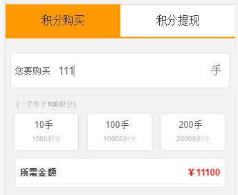
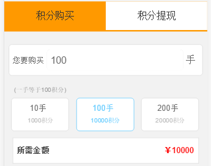

### Vue.js

>作为一个渣渣，我经常感叹前端要学的真多。。。 <br>
>当然不是每一种框架都要去学，毕竟精力有限，暂时我的目标就是学好javascript、掌握一种框架。至于为什么选Vue.js，Angular和React都了解过，可能是个人偏好吧，一学到Vue就喜欢上了。
>Vue2.0中总结了几种前端框架的对比，可参考[Vue对比其他框架](https://vuefe.cn/guide/comparison.html) <br>
> 推荐知乎上一篇尤雨溪的文章 [新手向：Vue 2.0 的建议学习顺序](https://zhuanlan.zhihu.com/p/23134551)  <br>
这个项目是一边学Vue一边弄的，主要利用了Vue的声明式的数据渲染、响应的数据绑定特点。 <br>
#### 1、声明式渲染
Vue的核心是可以用简洁的模板语法来声明式的将数据渲染进 DOM 的系统。 <br>
例如 <br>
###### HTML内容
```HTML
		<div id="reportList" class="reportList">
			<ul>
				<li class="report-list" v-for="Item in Items">
					<div class="items-header">
          <!-- 数据绑定最常见的形式就是使用 “Mustache” 语法（双大括号）的文本插值 -->
						<span class="items-time"><em data-id="{{ Item.startTime }}">{{ Item.startTime }}</em>至<em data-id="{{ Item.finishTime }}">{{ Item.finishTime }}</em></span>,
						<span class="items-times">{{ Item.num }}笔</span>
						<span class="items-person">{{ Item.memberName }}</span>
					</div>
					<div class="items-content">
						<span class="items-title">{{ Item.storeName }}</span>
						<span class="items-capital">{{ Item.amount }}元</span>,
						<span class="items-items-score">{{ Item.points }}积分</span>,
						<span class="items-benifit">收益{{ Item.income }}元</span>
						<input id='list-page' type="hidden" value="{{ Item.page }}">
					</div>
				</li>
			</ul>
		</div>
```
###### javascript内容
```javascript
			var vm = new Vue({
				el:'.report',
				data: function () {
					return {
					// Items: []
				};
			}, 
			created:function(){
				var self = this;
				$.ajax({
					type:'get',
					url:'XXX?'+tmpl,
					dataType:'jsonp',
					jsonpCallback:'callback',
					success:function(data){
						self.$set("Items", data);
						console.log(data);
					},
					error:function(errorThrow){
						console.log(errorThrow);
					}
				});
			}
		}); 
```


#### 2、响应的数据绑定
效果图：     <br>
要求：可以直接输入购买多少手（1手 = 100元），也可以单击三个选项（10手、100手、200手），点击了10手的时候输入框里也为10手、金额里的值为1000.
###### HTML内容
```HTML
    <form class="number" action="">
			<span class="numbertext">您要购买</span>
			<input v-model="numberinputPurchasere" class="numberinput numberinput-purchasere" type="text"/>
			<span class="numberunit">手</span>
		</form>
		<div class="scoreexplain">(一手等于100积分)</div>
		<div class="optional">
			<ul class="g-clear">
				<li value="10" v-on:click="choice" class="optionalitem">
					<input class="optionalselect" type="radio" value="10" v-model="numberinputPurchasere">
					<span class="optionalnum">10手</span>
					<span class="optionalscore">1000积分</span>
				</li>
				<li value="100" v-on:click="choice" class="optionalitem">
					<input class="optionalselect" type="radio" value="100" v-model="numberinputPurchasere">
					<span class="optionalnum">100手</span>
					<span class="optionalscore">10000积分</span>
				</li>
				<li value="200" v-on:click="choice" class="optionalitem">
					<input class="optionalselect" type="radio" value="200" v-model="numberinputPurchasere">
					<span class="optionalnum">200手</span>
					<span class="optionalscore">20000积分</span>
				</li>
			</ul>
		</div>
		<div class="amount">
			<span class="amounttext">所需金额</span>
			<div  class="ammountscore">￥{{ ammountscore }}</div>
		</div>
```
###### javascript内容
```javascript 
		var V = new Vue({
			el:'#purchaserescore',
			data: function () {
				return {
					// Items: []
				};
			}, 
			methods:{
				getVaule : function(parames){
					$(".ammountscore").text();
				},
			},
			computed:{
				ammountscore:function(){
					if(this.numberinputPurchasere == null){
						return 0;
					}else{
						return this.numberinputPurchasere *100;
					};
				}
			}
		});
```
所以很简单的几行代码就可以做出这个效果，当然我这里只是用到Vue冰山一角的作用，Vue很强大也很轻便。


